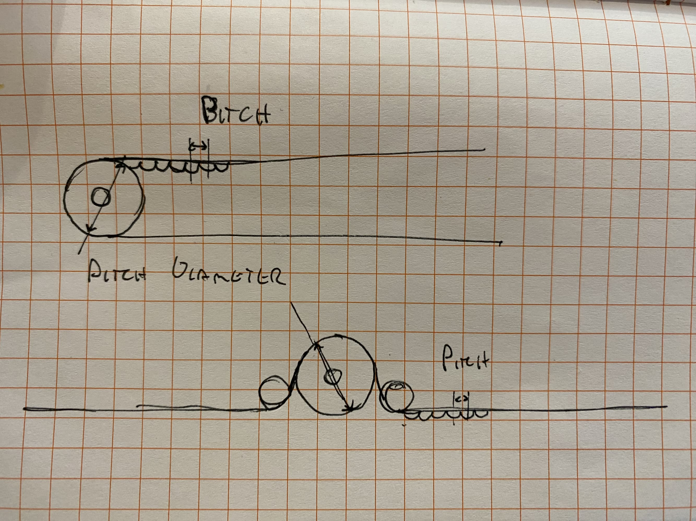
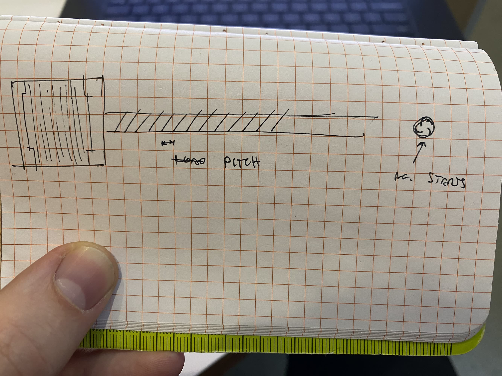

---
title: Steps Per Unit
parent: Calculators 
layout: page
--- 

## Belt Drives



```
todo here
 - drawing w/ labels, 
 - inputs are one color, outputs some other color ? 
 - dropdown menu for common belt types
  - this should reference belt profile drawings 
 - copy output to clipboards 
 - call-outs / notes on i.e. microstepping 
```

<p>
  <label for="input">Steps per Revolution</label>
  <input type="number" id="spr" oninput="calculate()" value="200"/>
</p>
<p>
  <label for="input">MicroStepping?</label>
  <input type="number" id="microstep" oninput="calculate()" value="16"/>
</p>
<p>
  <label for="input">Belt Pitch</label>
  <input type="number" id="pitch" oninput="calculate()" value="2"/>
</p>
<p>
  <label for="input">no. Teeth on Pulley</label>
  <input type="number" id="count" oninput="calculate()" value="20"/>
</p>
<p>
  <label for="output">Pitch Diameter:</label>
  <input type="number" id="output_pd" readonly />
</p>
<p>
  <label for="output">Steps Per Unit:</label>
  <input type="number" id="output" readonly />
</p>

## Lead or Ball-Screws



```
todo
- explain no. of starts vs pitch measurement ? 
```

<p>
  <label for="input">Steps per Revolution</label>
  <input type="number" id="spr_lead" oninput="calculateLeadScrew()" value="200"/>
</p>
<p>
  <label for="input">MicroStepping?</label>
  <input type="number" id="microstep_lead" oninput="calculateLeadScrew()" value="16"/>
</p>
<p>
  <label for="input">Lead Pitch</label>
  <input type="number" id="pitch_lead" oninput="calculateLeadScrew()" value="2"/>
</p>
<p>
  <label for="input">no. Starts</label>
  <input type="number" id="starts_lead" oninput="calculateLeadScrew()" value="4"/>
</p>
<p>
  <label for="output">Lead per Revolution</label>
  <input type="number" id="output_lead_per_rev" readonly />
</p>
<p>
  <label for="output">Steps Per Unit:</label>
  <input type="number" id="output_lead" readonly />
</p>

<script src="{{site.baseurl}}/calculators/js/stepsPerUnit.js" type="text/javascript"></script>
