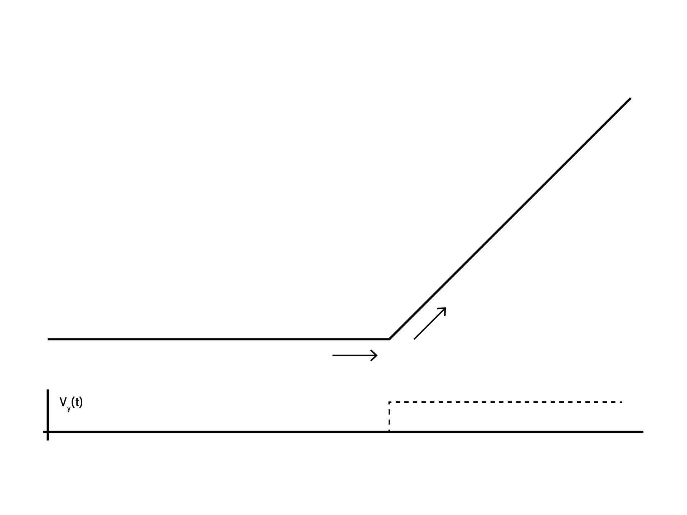
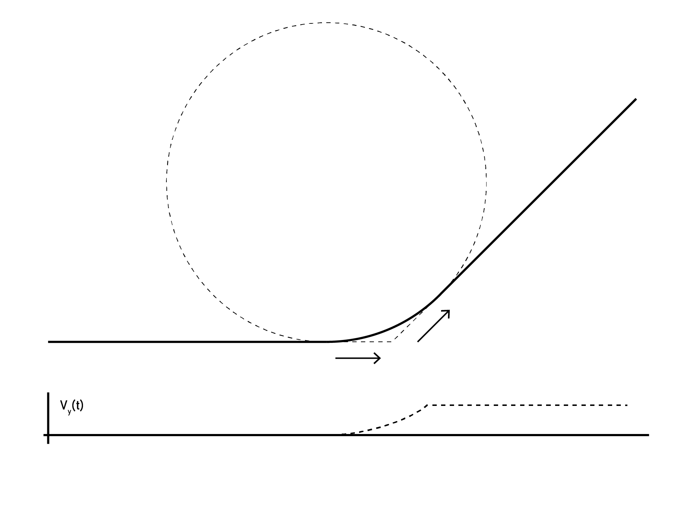

Junction Deviation is the name given to an algorithm that is commonly used[^controllers_that_use] in motion controllers to find cornering velocities between line segments. 

> some of this is perhaps better as boilerplate for the machine-control topic in-general, i.e. that accel limiting is wise due to FMA 

Perhaps more fundamentally, JD lets us trade a small amount of precision for vast improvements in speed. To start, let's imagine we have a motion controller that obeys some limits to acceleration for all time.

$$
A_{min} < A(t) <= A_{max}
$$

Because acceleration produces forces that act on the machine chassis ... $$F = MA$$ ... we want to limit $A$ such that we avoid exerting stresses that might deflect or destroy our machine's structure. Even small forces can have real consequences in machine control, and we typically design our force limits with our machines' [stiffness](TODO) in mind, to avoid some maximal deflection[^stiffness-runaway-aside]. 

So, supposing we are a motion controller that ingests line segments, and we want to traverse along a corner at some fixed velocity:

It turns out that it is impossible to traverse this corner at *any* velocity without subjecting the machine to *infinite* acceleration at the junction. This might seem counter-intuitive (especially since machines seem to do this regularely!) but if we think about the y-axis speed alone, it goes from $$0 \rightarrow v\sin(180 - \theta)$$ instantaneously at the junction. 

This is where Junction Deviation comes in. Basically, we trade some precision (we normally don't need to hit the junction *exactly*) for the ability to corner at non-zero velocities. In very many cases, this is a worthwhile trade - especially because only a small deviation can result in vastly improved cornering speeds. Typically, we design these deviations to be ~ similar in scale to our machines' absolute accuracy (i.e. most FDM 3D printers use a JD of around $0.1 \rightarrow 0.2 mm$).

## Computing JD 

To make this approximation, we need to do a little bit of linear algebra and trig. 

> fig w/ trig-things labelled

... discussion 

> fig w/ 170, 135, 90, 32 angles and their computed values... 

## Computing JD (Quickly, and with Limited Computing)

- less sqrts, 
- ptr to fixed point ? 

## Actual JD

In a more modern motion controller, we should actually travel along this arc segment - unsurprisingly... 

This requires evaluating an arc in real-time...

This also requires fitting the segments to given lines, and i.e. managing cases where line segments themselves are smaller than the arc... 

## Lossy JD

JD was originally developed[^when] when computing resourced deployed in motion controllers was limited. In these contexts, 

- how to compute it (quickly) 
- given anisotropic acceleration, which should we pick for the corner ? 
- limits to JD, viability of actually travelling along arcs ... 

--- 

[^controllers_that_use]: Junction Deviation is deployed in GRBL and its decendents: Marlin, TinyG, and Smoothieware (that I know of). I'd like to classify these as the `8-bit Generation` of motion control: linear segments, JD, (mostly) infinite jerk / limited acceleration. Controllers whose designs were perhaps dominated by a lack of computing resource. 

[^when]: TODO: figure out when actually did JD first emerge? 

[^stiffness-runaway-aside]: This can become an especially tricky design study because increasing stiffness tends to increase weight, meaning we need to use lower acceleration limits to hit the same forces (and actually decrease deflection). As is very often the case, we want high stiffness with low weight... 