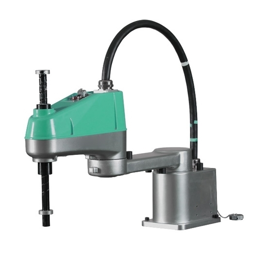

# Kinematics {#sec-kinematics}

Kinematics refers to **how our machines move through space.** 

## Layout

Picking an appropriate machine layout is probably one of the first things we do when thinking of a new machine: this is basically "in what order do the axes bolt on to one another" and there are a few prototypical forms we can see to get oriented:

### The Vertical Mill (VMC)

- XY "table"
- Z "vertical" 

These are the modern cousin to knee mills. Notice the large cantilever on the Z Axis: these are typically large machines w/r/t their build volumes. 

The VMC is a classic workhorse, and not *insurmountable* to build in the lab. See [this youtube channel](https://www.youtube.com/watch?v=rbqY8Mcbh0Q) to see a homebrew, 700kg epoxy granite build. 

Online there are [homebrew VMCs](https://www.youtube.com/embed/Or5AFj06iZw?start=523) using epoxy granite, and [maturing designs](https://github.com/MillenniumMachines/Milo-v1.5). 

### The Horizontal Mill (HMC) 

Smaller structural loops at the cost of slightly larger footprints and different ergonomics. 

via [Makino](https://www.youtube.com/watch?v=s5rtwZb8lz4)

For a quality discussion on milling machine design, see [this Makino talk](https://www.youtube.com/watch?v=9MU5Lp_8yt0). 

### 5 Axis

There's a few ways to skin the 5ax cat, and debate as to which is best. For a five axis machine, we essentially have all of the DOF we might need to machine any geometry (as the 6th axis, rotation along the axis of the spindle, is redundant), but varying layouts offer varying stiffnesses & "reachability" - how easy it is to manouver the tool onto i.e. the underside of a work piece. Part fixturing here also becomes important! 

Images from Haas, Okuma and GROB.

 

Machine layout is also a packaging question; designers also need to locate tool magazines, coolant pumps, chip extractors, etc - and accomodate machinist ergonomics. This extends in part to architecture, as productivity per sqft is often a driving metric. This is especially true if we hope to do more manufacturing in cities. 

 

### Bed Mill / Gantry Machines 

- XY "gantry" and fixed bed 
- Z Axis mounted to X Gantry

These are typically "wide and flat" and prioritize XY traverse speeds. They are typically about the same size as their working volumes, making them suitable for large format machining of (i.e.) 4x8' stock or longer. Stock material are typically sheet-like. 

### Scara Arms 

"Scara" arms are two or three-DOF (adding Z) machines typically made for rapid motion: the rotary linkages are lighter to swing around than heaving large axis over the same work space. In addition, they have small footprints relative their work area.

 

Building a Scara involves also solving the inverse kinematics to translate from cartesian positions to joint angles, 

  
[from How To Mechatronics](https://howtomechatronics.com/projects/scara-robot-how-to-build-your-own-arduino-based-robot/) 

Dual Scara arms ("parallel robots") also exist,

<iframe width="560" height="315" src="https://www.youtube.com/embed/R_AIzCTYBNs" frameborder="0" allow="accelerometer; autoplay; clipboard-write; encrypted-media; gyroscope; picture-in-picture" allowfullscreen></iframe>

### Delta Robots

<iframe width="560" height="315" src="https://www.youtube.com/embed/ctnBFqRRjrg?start=45" frameborder="0" allow="accelerometer; autoplay; clipboard-write; encrypted-media; gyroscope; picture-in-picture" allowfullscreen></iframe>

### Robot Arms

These are everywhere, and typically used for material handling / "generalized" automation. They are long forward-chains of rotary transforms, ang gearboxes / actuators capable of producing enough torque (at low enough weights) remain expensive. 

 

A 6 DOF robot arm can hold any "pose" (3 positions, 3 rotations) with only one joint solution (actual orientation of the arm), but some newer arms include 7 DOF, such that they can hold any pose while retaining a "null space" where the robot's joints can rotate through a range of possible orientations that still maintain the end effector pose. This allows the robot arm to be moved out of the way of obstacles in it's working environment while maintaining position of the end effector: 

<iframe width="560" height="315" src="https://www.youtube.com/embed/XSsroN7dUlM" frameborder="0" allow="accelerometer; autoplay; clipboard-write; encrypted-media; gyroscope; picture-in-picture" allowfullscreen></iframe>

### Etc!

There are infinitely many variations on machine kinematics, like I said earlier these lists are not extensive. We can do better with our time to try to understand some of nuance that might appear as we design these things. 

## Transform Matrices

<iframe width="560" height="315" src="https://www.youtube.com/embed/vlb3P7arbkU" frameborder="0" allow="accelerometer; autoplay; clipboard-write; encrypted-media; gyroscope; picture-in-picture" allowfullscreen></iframe>  
[from Northwestern](https://modernrobotics.northwestern.edu/nu-gm-book-resource/3-3-1-homogeneous-transformation-matrices/) 

If we need to (typically only when we have rotary joints) we can formulate a machine's kinematics in terms of **homogeneous transform matrices** or **HTMs** - here, from some 'ground' reference space (or **world coordinate system WCS**) we can express each subsequent axis location as some multiplication of HTMs. 

## Constraint 

While machine layout is blatantly obvious, the way a machine's **kinematic constraints** are worked out is often more subtle. Understanding kinematic constraint can make a world of difference during machine design, but it is often overlooked. 

There are others who do a better job at this than I can, so I would point us towards [this pdf](https://wp.optics.arizona.edu/optomech/wp-content/uploads/sites/53/2016/08/16-Kinematic-constraint-1.pdf) from the University of Arizona.

 
[from Practical Precision](https://practicalprecision.com/kinematic-constraint/) 

We typically become acquanted with this idea through **kinematic couplings** that precisely constrain *one rigid contact* between two bodies, along all 6 DOF. Slocum has done [a review on these](https://www.sciencedirect.com/science/article/abs/pii/S0890695509002090) in 2010, where this image is from:

 

We can see that this is composed of elements from the earlier image. We find these in practice most often in toolchangers like Joshua Vasquez:

<iframe width="560" height="315" src="https://www.youtube.com/embed/cfSHss5j5KU" frameborder="0" allow="accelerometer; autoplay; clipboard-write; encrypted-media; gyroscope; picture-in-picture" allowfullscreen></iframe>

Or in optical mounts like this:

 

Most kinematic mounts are **low stiffness** because **points of contact are meant to be vanishingly small** (of course in practice they never are, and [Hertz Stress](https://en.wikipedia.org/wiki/Contact_mechanics) is where to start to understand why) and so we rarely see kinematic mounts used in high-load applications like CNC Milling. 

My own toolchanger is also a kinematic mount, although it's a bit unconventional (made for ease of manufacture & actuation) you can track that project [here](https://gitlab.cba.mit.edu/jakeread/hotplate).

### Not Just Couplings 

Kinematics is not just about couplings. One way to think of this: each of our Transform Matrices have one "loose" or unconstrained DOF: the degree of freedom that is actuated at that junction. Kinematics is about **precisely constraining all other degrees of freedom in the matrix** without "binding up" the free DOF. 

I think I only have time for one of these examples, but it's the most common: if we consider a gantry machine with two Y Axes, like [clank](https://gitlab.cba.mit.edu/jakeread/clank):

This means that when the motors are turned *off* the Y Axis is free to rotate somewhat in the XY plane:

But when the motors are on, this is perfectly constrained. If the Y-Left assembly and Y-Right assembly were identical, Clank would be over-constrained. It's worth noting that if we were to write a suitable controller for Clank, we could control this slight rotation in the XY plane of the Y axis: the machine has "three axis" but four motors: using differential drive on the Y-Left and Y-Right motors would allow use of the "loose" DOF here. In practice, the motors simply mirror one another. 

Most importantly, this design means that the left-side Y rail and right-side Y rail **do not have to be perfectly parallel** - because the Y-Right assembly has no X constraint, the rail on this side can "wander" without causing two X-Constraints to fight with one another. 

So: a bit subtle, kind of boring, and easy to ignore, but careful kinematic design is what can make your machine glide like this:

### Kinematics & Structure 

We can also think about structures has having DOF, i.e. in the case of unstable (underconstrained), stable (well constrained) and indeterminate (overconstrained) frames. In a sense, structural stability and kinematic constraint are one and the same. 

  
[from Maxwell](http://www.clerkmaxwellfoundation.org/Newsletter_2015_Winter.pdf) or see [og Maxwell](https://www.tandfonline.com/doi/abs/10.1080/14786446408643668?needAccess=true&journalCode=tphm15) 