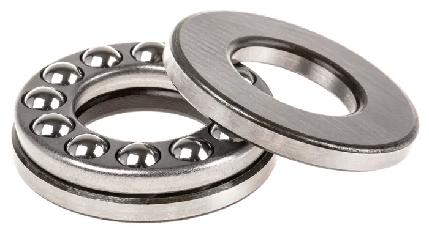
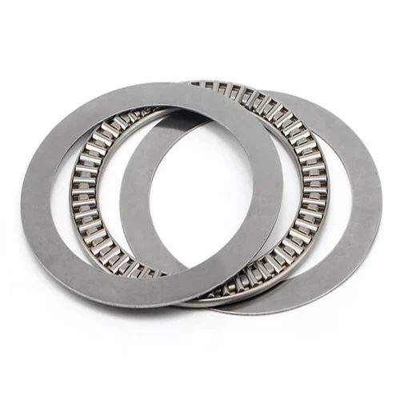

--- 
title: Bearings
layout: page
parent: Parts 
---



... ultimate performance is related to [? Hertz Contact](), and lifetimes vary depending on how they are loaded, environment... the dark art of [? Tribology](). Long form reference: NASA: [Roller Bearing Life Prediction, Theory and Application](../../reading/nasa_roller_bearing_theory_and_app.pdf). 

## Nomenclature





## Plain Bearings 

Stub! 

## Deep Groove Ball Bearings

The most common bearing type, "deep groove" ball bearings are designed primarily for radial loading, but can be deployed to handle small axial or momentary loads (with middling and poor success, respectively). This tends to happen more often than it should since these parts are so ubiquitous. 

In momentary loading conditions, it is possible to [preload two deep-groove bearings]() together as if they were an angular contact set. 

trade # | id | od | t | dynamic (kN) | static (kN) | price (1, vxb) | note 
--- | --- | --- | --- | --- | --- | --- | ---
**625** | 5 | 16 | 5 | 1.7 | 0.67 | 2.4 | 
605 | 5 | 14 | 5 | 1.3 | 0.51 | 5.1
**624** | 4 | 13 | 5 | 1.3 | 0.5 | 3.95 
604 | 4 | 12 | 4 | 1 | 0.35 | 4.7
619/4 | 4 | 11 | 4 | 1 | 0.35 | n/avail
623 | 3 | 10 | 4 | 0.63 | 0.22 | 6.7
**6806** | 30 | 42 | 7 | 4.5 | 2.9 | 13 | BB30 Bottom Bracket Bearing 
6808 | 40 | 52 | 7 | 4.9 | 3.5 | 19.5 
6810 | 50 | 65 | 7 | 6.7 | 6.8 | 24.5 
6812 | 60 | 78 | 10 | 11.9 | 11.4 | 31 

## Angular Contact 

Commonly deployed in pairs in various arrangements... 



### Double Row Angular Contact

Normally fancy and expensive, two sizes have become cheap and ubiquitous thanks to [bicycle headset designs](https://www.whiteind.com/product/headset-bearings/). 



## Thrust Bearings

| | | 
| --- | --- | 
|  |  |

Thrust Bearings are designed to be used exclusively in axial loading, and are often used in conjunction with other bearings that constrain other system DOF. For example, ... . Since thrust-bearing races are often quite simple (i.e. flat) they are also often integrated directly into some other components. 

While they can be found using ball, cylinder or "barrel" type rolling elements, cylinders (or "needles") are the most common. 

## Cylindrical Roller Bearings 

Designed to carry more load by increasing Hertzian contact patch sizes, *Cylindrical Roller Bearings* are just what you would expect from their name, deploying dowel-like steel roller elements where other bearings use simple balls.



### Cross Roller Bearings

Kind of a mixture of double-row angular contact and cylindrical roller bearings, *Cross Roller Bearings* are the workhorse bearing of industrial robotics, for their capability to withstand huge loads in all loading conditions, and deliver high stiffness to boot. Besides their relatively high running friction (which is fine for a robot arms' outputs) and high cost, these are the perfect bearing. 



## Needle Roller 

Stub !

## Linear Variants

Stub ! 

## Hydrostatic 

Stub ! 