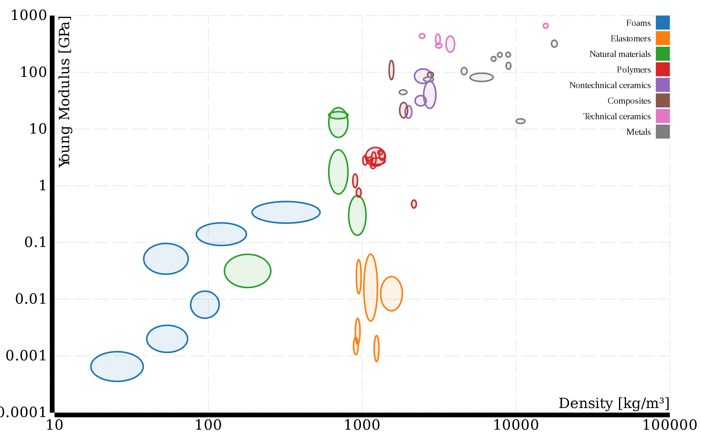

---
title: Materials
parent: Parts 
layout: page
--- 

# Materials 

The "ashby chart" relates density and stiffness:

Ben of CBA shows how lattices and metamaterials can expand this space [here](http://cba.mit.edu/docs/papers/19.01.vacuum.pdf) and [here](http://cba.mit.edu/docs/papers/18.06.msec.metal.pdf)

See also [these Univ. of Cambridge list of charts](http://www-materials.eng.cam.ac.uk/mpsite/interactive_charts/). 

I've put this table together for practical use:

| Material | Young's Modulus (GPA) | Density (kg/m^3) | Cost for 6mm x 24x24" | Machinability |
| --- | ---: | ---: | --- | --- |
| HDPE | 1 | 960 | 23 | Easy |
| PLA | 1.8 | 1240 | ($30 / kg) | 3DP
| ABS | 2 | 1050 | 52 | Not Dimensionally Stable, but OK to Machine |
| Acetal (Delrin) | 2.8 | 1300 | 89 | Breezy, also lasers, and non-cracking |
| Nylon 6 | 3 | 1100 | 130 | Painful |
| Cast Acrylic | 3.3 | 1100 | 46 | Breezy, esp. w/ Lasers |
| FR1/CE (Canvas / Phenolic) | 6 | ~1850 | 81 | TBD, probably WJ Pain and Ease on SB |
| FR4/G10 (Fiberglass) | 22 | ~1850 | 98 | Painful on a WJ, Slightly Easier on a Shopbot |
| 6061 ALU | 69 | 2710 | 87 | Breezy with WJ, Painful on Shopbot |
| Steel | 200 | 7860 | ~ 200 | Yes 