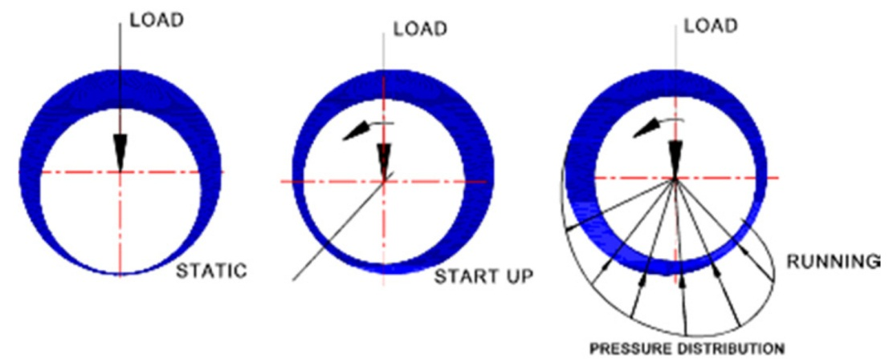

# Commercial Off-The-Shelf Components 

> aka COTS, 

## Bearings

Bearings make the world go 'round and we have developed "trade names" for commonly available sizes. You can think of these as a kind of modularity across industry: I know what a **624** bearing is, and so does my counterpart in Texas, Germany or Japan, and we all have access to them thanks to standards-bearing organizations. That said, of course they are not all created equal and are separated by **ABEC** ratings (where the higher number == more better) and also by types of shield: **-ZZ** means the bearing has two steel shields, **-2RS** means it has two rubber seals (for more friction but better grease retention). Open bearings (no code) are reasonable to use under light loads, but should properly only be included in assemblies where lubrication is found in the environment (i.e. in a crank-case, which is internally filled with oil). 

  
<a href='../../reading/nasa_roller_bearing_theory_and_app.pdf'>Image Source</a>

... ultimate performance is related to Hertz Contact, and lifetimes vary depending on how they are loaded, environment... the dark art of Tribology. Long form reference: NASA: [Roller Bearing Life Prediction, Theory and Application](../../reading/nasa_roller_bearing_theory_and_app.pdf). 

### Bearing Loads

Keep in mind that bearings **bear** load in multiple DOF:

  
[from SilverThin](https://www.silverthin.com/news/articles/moment-load-basics.php0)

The ability of a bearing to bear load is related again to [hertz stress](https://en.wikipedia.org/wiki/Contact_mechanics) between the rollers and the races. 

### Bearing Nomenclature

  

  
<a href='https://www.researchgate.net/publication/354956737_An_Experimental_and_Numerical_Evaluation_of_Seal_Strictness_on_Ball_Bearing_Performance'>Image Source</a>

### Plain Bearings

- the og 
- often bronze / some soft(er) material
- *not* of same hardness on both sides 
- somtimes "oil impregnated" 

 

#### Ways

#### Bushings 

### Roller Bearings

#### Deep Groove Ball Bearings

The most common bearing type, "deep groove" ball bearings are designed primarily for radial loading, but can be deployed to handle small axial or momentary loads (with middling and poor success, respectively). This tends to happen more often than it should since these parts are so ubiquitous. 

In momentary loading conditions, it is possible to preload two deep-groove bearings together as if they were an angular contact set. 

trade # | id | od | t | dynamic (kN) | static (kN) | price (1, vxb) | note 
--- | --- | --- | --- | --- | --- | --- | ---
**625** | 5 | 16 | 5 | 1.7 | 0.67 | 2.4 | 
605 | 5 | 14 | 5 | 1.3 | 0.51 | 5.1
**624** | 4 | 13 | 5 | 1.3 | 0.5 | 3.95 
604 | 4 | 12 | 4 | 1 | 0.35 | 4.7
619/4 | 4 | 11 | 4 | 1 | 0.35 | n/avail
623 | 3 | 10 | 4 | 0.63 | 0.22 | 6.7
**6806** | 30 | 42 | 7 | 4.5 | 2.9 | 13 | BB30 Bottom Bracket Bearing 
6808 | 40 | 52 | 7 | 4.9 | 3.5 | 19.5 
6810 | 50 | 65 | 7 | 6.7 | 6.8 | 24.5 
6812 | 60 | 78 | 10 | 11.9 | 11.4 | 31 

#### Angular Contact 

Commonly deployed in pairs in various arrangements... 

- specialized
- (tandem) moment loads
- (single) axial loads 
- pay attention to preload 

 

  
<a href='https://www.skf.com/us/products/rolling-bearings/ball-bearings/angular-contact-ball-bearings'>Image Source</a>

Normally fancy and expensive, two sizes have become cheap and ubiquitous thanks to [bicycle headset designs](https://www.whiteind.com/product/headset-bearings/) e.g. [1-1/2" Bicycle Headset AC](https://www.vxb.com/1-1-2-sealed-Bicycle-Headset-Bearing-40x52x6-5mm-p/38-1mm-bicycle-headset-bearing.htm), [1-1/8" Bicycle Headset AC](https://www.vxb.com/sealed-Bicycle-Headset-Bearing-36-45-p/30-15-bicycle-headset-bearing.htm)

#### Double Row Angular Contact

  

#### Thrust Bearings

| | | 
| --- | --- | 
|  |  |

Thrust Bearings are designed to be used exclusively in axial loading, and are often used in conjunction with other bearings that constrain other system DOF. For example, ... . Since thrust-bearing races are often quite simple (i.e. flat) they are also often integrated directly into some other components. 

While they can be found using ball, cylinder or "barrel" type rolling elements, cylinders (or "needles") are the most common. 

#### Needle Rollers

 

- higher loads
- thrust (axial) or radial configurations
- occasionally direct-on-shaft 

#### Cylindrical Roller Bearings 

Designed to carry more load by increasing Hertzian contact patch sizes, *Cylindrical Roller Bearings* are just what you would expect from their name, deploying dowel-like steel roller elements where other bearings use simple balls.

  
<a href='../../reading/nasa_roller_bearing_theory_and_app.pdf'>Image Source</a>

#### Cross Roller Bearings

Kind of a mixture of double-row angular contact and cylindrical roller bearings, *Cross Roller Bearings* are the workhorse bearing of industrial robotics, for their capability to withstand huge loads in all loading conditions, and deliver high stiffness to boot. Besides their relatively high running friction (which is fine for a robot arms' outputs) and high cost, these are the perfect bearing. 

 

  
<a href='https://us.misumi-ec.com/'>Image Source</a>

#### Tapered Roller Bearings

- basically high-load angular contacts
- common in (older) wheel bearings on automobiles 

 

#### Double Row Angular Contact

- pairs of angular contact in one assembly 

 

### Hydrostatic Bearings 

#### Journal Bearings

- oil (or air) film (aka hydrodynamic bearings)
- actively lubricated 
- should be high precision 
- extremely high loads (water turbines) 
- extremely high speeds (magic-angle resonance spinning (for science), turbochargers (for joy)) 

 

#### Air Bearings 

- pressurized,
- air can be surprisingly stiff... 

### Linear Variants

All of the above bearing styles are easiliy rearranged in linear cases, I'll just leave one example here, the rest can be left to the imagination:

 

For example, the linear guides discussed in the previous section **are bearings** - OK, I won't repeat myself. 

### Bearing Considerations

- don't pinch both races! 
- keep loads close to the bearing (offset principle & abbe error) 
- preload is your friend 

## Extrusion

Aluminum extrusions are extremely cheap, relatively stiff, **mostly** straight enough, and make it very easy to whip up machine chassis / rails with little effort. As such, they've become a fairly common solution in the machine building space. 

 

AKA **t-slot** framing:

 

I normally find this on [misumi](https://us.misumi-ec.com/vona2/mech/M1500000000/M1501000000/M1501010000/) and prefer the 5-Series for smaller machines (... clank). This is interchangeable with most other "20mm" spec extrusion found from a plethora of vendors. 

It's worth noting that making custom extrusion profiles is actually fairly cheap: a tool (die) can cost ~ 10k depending on complexity (and internal channels) after which the cost of extrusion ~= the cost of aluminum. 

## Motors

You're sure to find at least one NEMA 17 stepper motor in this class. NEMA is the National Electrical Manufacturers Association and their motor (flange) specifications are standard around the world. 

### N17

### N23

Smaller NEMA exist, N14, N11, N8, up to N34. The standard encompases not just Stepper motors but also BLDC drives. 

### Outrunner BLDCs

Also common are "outrunner" brushless motors, brough to dominance due to their common use in UAVs / Quadcopters. These can be excellent drives, but require more advanced control, and (what is often overlooked) **do not have internal bearings meant to withstand i.e loading against a rack and pinion, or a tensioned belt** 

 

Here, diameter is typically linked to a torque constant (pulling farther from the center == more torques). Particularities w/r/t the windings also change these ratings, known as 'kV' ratings (relating Volts to RPM, or in the inverse, to Torque). 

### Frameless BLDCs

These are more easily integrated into larger assembles. 

[cubemars](https://www.cubemars.com/category-129-RI+Series+Frameless+Inrunner+Torque+Motor.html), [lin engineering](https://www.linengineering.com/products/brushless-motors/frameless-bldc-motors/fl127-series/fl127cn007-02-ro), [t motor](https://store.tmotor.com/categorys/ri-seriesframeless-inrunning-torque-motor) 

## Transmission Elements

We've covered these in general, here are some particulars:

| part | link / pn | notes |
| --- | --- | --- |
| GT2 Belt 6mm Width Open Ended | [amazon](https://www.amazon.com/Meters-Timing-Fiberglass-Printer-LINGLONG/dp/B07MZLFPQJ/) |
| GT2 Belt 6mm Width 280mm Closed | [amazon](https://www.amazon.com/280-2GT-6-Timing-Belt-Closed-Loop/dp/B014SLWP68/) | 
| HTD 3M Belt 15mm Width Open Ended | [amazon](https://www.amazon.com/HTD-3M-Timing-Belt-Engraving/dp/B017S900KA/) | 
| 1204 Ballscrew | [amazon](https://www.amazon.com/SFU1204-Ballscrew-RM1204-Housing-Machine/dp/B076PCVC8F/)
| 1605 Ballscrew | [amazon](https://www.amazon.com/SFU1605-Ballscrew-RM1605-Housing-Machine/dp/B0756DZF1Z/)
| T8 Leadscrew | [amazon](https://www.amazon.com/Copper-Coupler-Hexagon-Bearing-Printer/dp/B07S1LKMQ6/) 
| Pushrods (linkage) | [amazon](https://www.amazon.com/Rustark-Stainless-Connector-Threaded-Helicopter/dp/B089SH34NN/)
| Rod Ends | [long](https://www.amazon.com/uxcell-3-0xL29mm-Steering-Linkage-Screws/dp/B07QPXWDCR/) and [short](https://www.amazon.com/uxcell-3-0xL15mm-Steering-Linkage-Helicopter/dp/B07Q2XLP42/)

- I prefer 9mm wide GT2 for the ~150% stiffness bump
- ballscrew i.e. '1605' means 16mm nominal diameter, 5mm pitch 

Other vendors for more advanced parts include:

[misumi](https://us.misumi-ec.com/)  
[sdp-si](https://sdp-si.com/)

